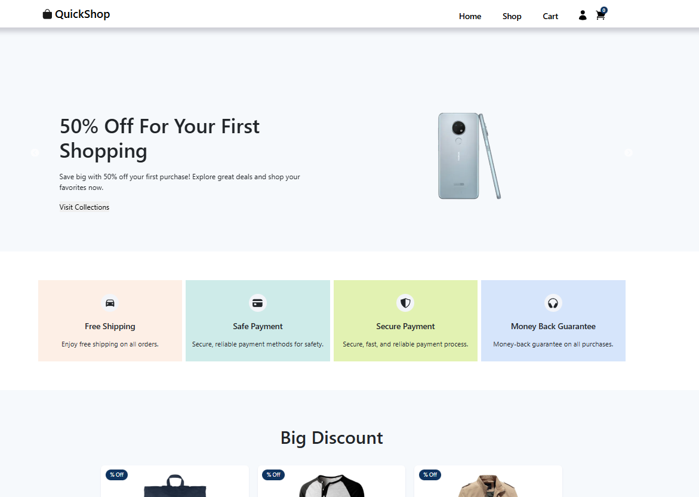
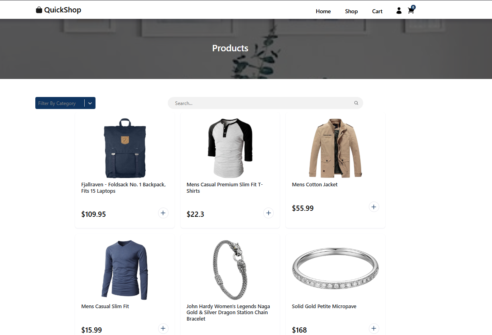
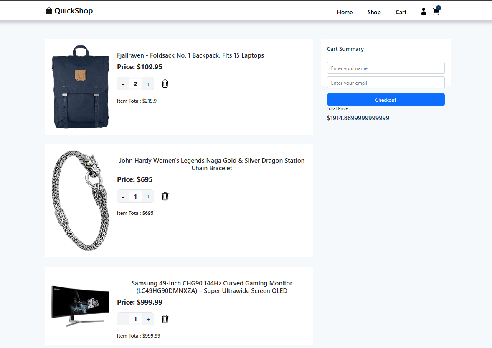
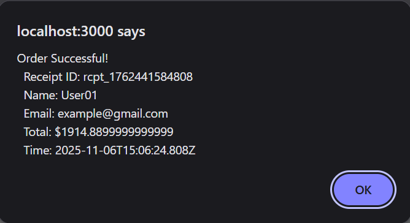

# 🛒 QuickShop – Full Stack E-Commerce Cart (Assignment Submission)

A full-stack shopping cart application built for the **Vibe Commerce Internship Assignment**.  
Implements product listing, cart management, checkout flow, backend APIs, MongoDB persistence, and FakeStore API integration.

---

## ✅ Features

### ⭐ Frontend (React)
- Product grid with **Add to Cart**
- Product detail page with image, description, category, rating
- Quantity increment/decrement buttons
- Cart page with:
  - Item quantity update
  - Remove item
  - Auto total calculation
- Checkout form (name + email)
- Checkout popup with order summary
- Fully responsive UI
- Global state management using **Redux Toolkit**
- Scroll-to-top, Filters, Search bar

### ⭐ Backend (Node + Express)
- REST APIs for:
  - ✅ GET `/api/products` (FakeStore API integrated)
  - ✅ GET `/api/cart`
  - ✅ POST `/api/cart`
  - ✅ DELETE `/api/cart/:id`
  - ✅ POST `/api/checkout`
- MongoDB persistence:
  - All orders are saved in the `orders` collection
- Error-handled routes
- CORS enabled
- Clean folder structure

### ⭐ Bonus Features Implemented ✅
- ✅ **Fake Store API integration**  
- ✅ **MongoDB persistence (orders saved permanently)**  
- ✅ **Error handling**  
- ✅ **Fully modular backend**

---

## 📁 Project Structure

```
QuickShop-Ecommerce-UI/
├── backend/
│   ├── routes/
│   │   ├── products.js
│   │   └── cart.js
│   ├── models/
│   │   └── order.js
│   ├── server.js
│   └── package.json
│
├── quickshop-ui/
│   ├── public/
│   │   └── screenshots/            
│   │       ├── home.png
│   │       ├── product.png
│   │       ├── cart.png
│   │       └── checkout.png
│   ├── src/
│   │   ├── components/
│   │   │   ├── Banner/
│   │   │   │   └── Banner.jsx
│   │   │   ├── ProductDetails/
│   │   │   │   ├── ProductDetails.jsx
│   │   │   │   └── product-details.css
│   │   │   ├── ProductReviews/
│   │   │   │   └── ProductReviews.jsx
│   │   │   ├── SeachBar/
│   │   │   │   └── SearchBar.jsx
│   │   │   └── FilterSelect.jsx
│   │   ├── pages/
│   │   │   ├── Home.jsx
│   │   │   ├── Shop.jsx
│   │   │   ├── Product.jsx
│   │   │   └── Cart.jsx
│   │   ├── utils/
│   │   │   └── products.js
│   │   ├── App.js
│   │   └── index.js
│   └── package.json
│
├── README.md
└── .gitignore
```
 
---

## 🛠️ Tech Stack

### Frontend
- React
- React-Bootstrap
- Redux Toolkit
- React Router
- CSS Modules

### Backend
- Node.js
- Express.js
- MongoDB Atlas
- Mongoose
- FakeStore API (third-party)

---

## 🚀 How to Run the Project Locally

### ✅ 1) Clone the repository

```bash
git clone <repo-url>
cd QuickShop-Ecommerce-UI
```

### ✅ 2) Backend setup

```bash
cd backend
npm install
```

Create a `.env` file in `backend/` with:

```env
MONGODB_URI=mongodb+srv://<username>:<password>@cluster0.xxxxxx.mongodb.net/QuickShop?retryWrites=true&w=majority&appName=Cluster0
```

Start backend:

```bash
npm start
```

Backend runs at: http://localhost:5000

### ✅ 3) Frontend setup

```bash
cd ../quickshop-ui
npm install
npm start
```

Frontend runs at: http://localhost:3000

## 📡 API Documentation (Backend)

### GET Products (proxied to FakeStore API)

```bash
GET http://localhost:5000/api/products/external
```
- Cart
  - GET `http://localhost:5000/api/cart`
  - POST `http://localhost:5000/api/cart`
    ```json
    {
      "productId": "1",
      "qty": 2,
      "name": "Product title",
      "price": 109.95,
      "imgUrl": "https://.../image.png"
    }
    ```
  - DELETE `http://localhost:5000/api/cart/:id`

- Checkout (persists order in MongoDB)
  - POST `http://localhost:5000/api/checkout`
    ```json
    {
      "name": "Hemant",
      "email": "hk@gmail.com",
      "cartItems": [
        { "productId": "1", "qty": 2, "price": 109.95 },
        { "productId": "2", "qty": 1, "price": 22.3 }
      ]
    }
    ```
    Response example:
    ```json
    {
      "receiptId": "rcpt_176243516742",
      "total": 4170,
      "timestamp": "2025-11-06T06:30:00.000Z",
      "items": [ ... ]
    }
    ```

Orders are saved to MongoDB Atlas → Database: `QuickShop` → Collection: `orders`.

## 🎬 Demo Video

<p align="left">
  <a href="https://youtu.be/Pm46Q_rFo-U" target="_blank">
    
  </a>
  
</p>

---

## 📸 Screenshots

Place your screenshots in `quickshop-ui/public/screenshots/` with these filenames, or update the paths below:

| Home | Product |
|------|---------|
|  |  |

| Cart | Checkout |
|------|----------|
|  |  |

